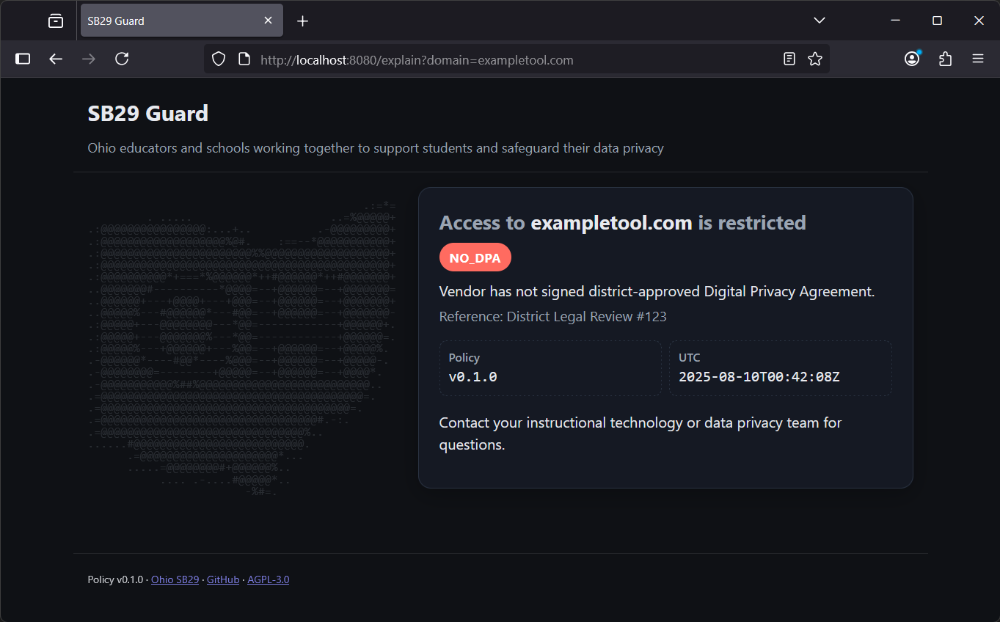

# SB29-guard 🚦📘

Making blocked ed‑tech domains less confusing (and more transparent) for teachers & students. Protecting student data is a noble objective, and can be done in ways that lift up our communities.

<em>Built by a teacher, for teachers — to protect educators, reduce friction, and make compliance humane.</em>

<!-- Badges -->

  

District‑friendly tool that shows a clear, plain‑language “Why was I redirected?” page when staff or students try a site without an approved Data Privacy Agreement (SB29 context). One small self‑contained binary. No tracking. No student data stored.

## The gist
- Show a friendly explanation page when a restricted domain is visited.
- Keep a simple, auditable policy (YAML or Google Sheet).
- Proxy‑first (recommended): integrate with your gateway to forward the original host or 302 to the explain page for seamless HTTPS handling.
- DNS artifacts are supported for coarse routing, but DNS‑only cannot present a friendly page for HTTPS due to TLS/SNI.

## Get started
- School Mode (recommended): Integrate with your proxy/gateway — see `docs/implementers/proxy.md`.
  - Quickstarts: NGINX, Caddy, HAProxy, Apache
    - `docs/implementers/nginx-quickstart.md`
    - `docs/implementers/caddy-quickstart.md`
    - `docs/implementers/haproxy-quickstart.md`
    - `docs/implementers/apache-quickstart.md`
  - GUI‑driven proxies (APIs/lists): `docs/implementers/gui-proxy.md`
- Prefer your own stack? See implementers overview and deployment guides:
  - `docs/implementers/README.md`
  - `docs/deployment/` (BIND, Unbound, Pi-hole, Windows DNS, pfSense, OPNsense, Infoblox)

## Downloads and images
- Releases (binaries + SHA256SUMS): GitHub → Releases
- Container image (GHCR): `ghcr.io/ricec-at-masonhs/sb29-guard:v1.x.x` (pin a version or digest; latest stable is v1.1.x)

## Try it locally
- Using the binary:
  - `sb29guard version`
  - `sb29guard validate --policy policy/domains.example.yaml`
  - `sb29guard serve --policy policy/domains.example.yaml`
- From source (no install):
  - `go run ./cmd/sb29guard version`
  - `go run ./cmd/sb29guard validate --policy policy/domains.example.yaml`
  - `go run ./cmd/sb29guard serve --policy policy/domains.example.yaml`

Quick proxy sanity check (header‑injection):
- With the server running: `Invoke-WebRequest -UseBasicParsing -Uri http://127.0.0.1:8080/explain -Headers @{ 'X-Original-Host'='exampletool.com' } | Select-Object -ExpandProperty StatusCode`
  - Expect 200 if exampletool.com is blocked in your policy; otherwise 404 Not Classified (pass‑through model).

Local examples:
- Generate example proxy bundles locally: `make examples` (writes to `dist/`, which is ignored by git)

Automation scripts
- Windows nightly fetch/import: `docs/implementers/scripts/windows-fetch-and-import.ps1`
- Linux nightly fetch/reload: `docs/implementers/scripts/linux-fetch-and-reload.sh`

## Operators: where to read more
- Technical Reference (headers, caching, CSV refresh, metrics, verification): `TECHNICAL.md`
- Proxy/Gateway integration (school‑seamless, default recommendation): `docs/implementers/proxy.md`
- One‑page quickstarts (copy/paste): see `docs/implementers/` quickstarts and `docs/implementers/gui-proxy.md`
- Deployment guides (platform specifics): `docs/deployment/`
- Customizing the UI/templates: `CUSTOMIZING.md`

## Developers
- Contributing: `CONTRIBUTING.md`
- CLI design and behavior: `docs/cli-design.md`
- Print version: `sb29guard version` (release builds embed version/commit/date)

## License and notice
- License: AGPL‑3.0 (see `LICENSE`)
- Disclaimer: Coordinate with your legal/data privacy teams; this aids transparency and workflow but doesn’t replace legal review.

Questions or ideas? Open an issue. Contributions welcome.
