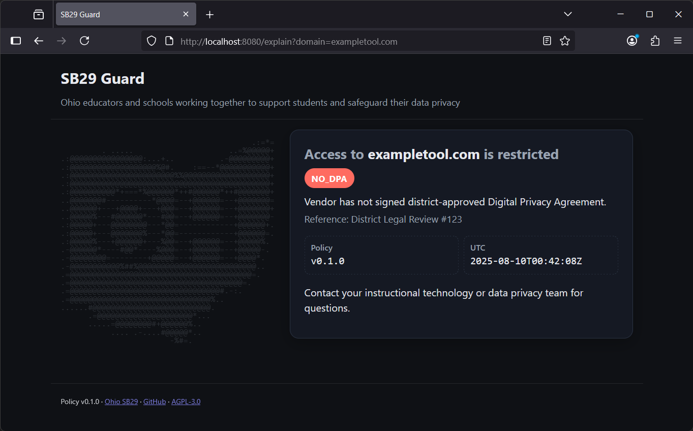

# HAProxy quickstart (School Mode)

Goal: run SB29-guard with HAProxy so blocked requests show a friendly explain page.

Preview

Note
- Bundles aren’t committed to git; they’re generated into dist/ and may be overwritten.

Prereqs
- SB29-guard reachable (e.g., http://127.0.0.1:8080)
- Vhost for blocked traffic, e.g., blocked.school.local

Generate example bundle (one-liner)
- sb29guard generate-proxy --format haproxy --mode header-injection --site-host blocked.school.local --backend-url http://127.0.0.1:8080 --bundle-dir dist/haproxy

Try this first (minimal config)
- sb29guard generate-proxy --format haproxy --mode header-injection --site-host blocked.school.local --backend-url http://127.0.0.1:8080 --dry-run > haproxy.cfg
- haproxy -f haproxy.cfg -db

Install and verify
- Copy haproxy.cfg to your system location or include it from main config; reload HAProxy.
- curl -H "Host: blocked.school.local" -H "X-Original-Host: exampletool.com" http://127.0.0.1:80/explain
- Expect 200 and explain HTML; non-listed domains pass through (404 from guard).

Selective routing map (optional)
- If you pass --policy or --sheet-csv, blocked.map is generated (includes base and .base for wildcards).

Notes
- Ensure required ACLs; check logs if you see 404 unexpectedly.

Set-and-forget
- Preferred: keep HAProxy static as a forwarder; sb29-guard nightly refresh handles policy changes.
- If you need a host map within HAProxy, generate `blocked.map` nightly from YAML or the Google Sheet and update via the Runtime API (no reload) when possible; otherwise perform a quick reload.
- Alternatively, use the GUI/list route by importing `/domain-list` into your filtering product via the provided scripts.

See also
- Example bundle: dist/haproxy/README.md
- Proxy overview: docs/implementers/proxy.md
- GUI/list integrations: docs/implementers/gui-proxy.md
